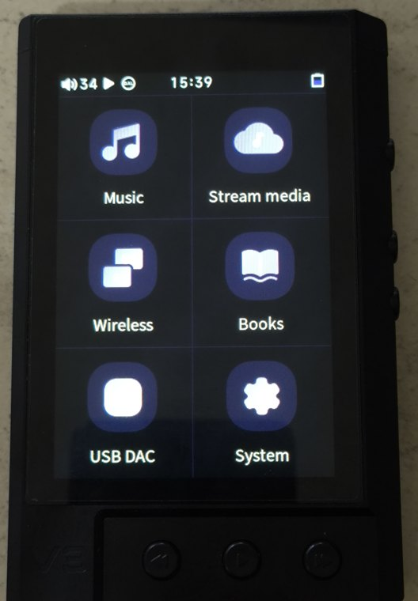
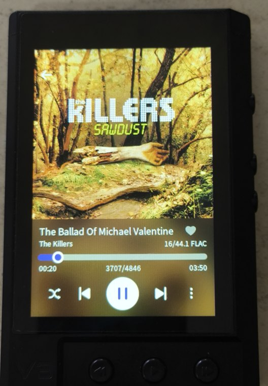

<h1 align="center">V3 Blaze — v1.3 Firmware</h1>

<b>Firmware oficial TempoTec v1.3 con la corrección confirmada del decoder LDAC. Dos ediciones.</b> Interfaz original o el port completo de estilo HiBy. Ambas probadas en hardware.

 &nbsp; 

[English](README.md) · [Instalación](docs/INSTALL.md) · [Recuperación](docs/RECOVERY.md) · [Notas técnicas](docs/HOW-IT-WORKS.md) · [Compilación](docs/BUILD.md)

La generación actual parte del firmware oficial `V3_ANALOG_2025` **v1.3**. Versión/tag del proyecto: **v1.1.0**. La versión del proyecto es independiente de la base TempoTec. Las fotos conservan la identidad visual del Full Mod anterior; no son un registro nuevo de pruebas de cada pantalla en v1.3.

## Dos descargas

**Stock + LDAC Fix** — `V3-Blaze-v1.3-Stock-LDAC-Fix.upt`: aspecto y funciones oficiales de TempoTec v1.3, incluidos PEQ y sus mejoras de estabilidad, más la corrección de este proyecto para la corrupción digital LDAC de v1.3, confirmada en el dispositivo. Son los bytes exactos del TEST 2 probado en hardware. Sin tema, launcher, ajustes de caché/E/S ni parche personalizado del reproductor.

**Full Mod** — `V3-Blaze-v1.3-Full-Mod.upt`: la misma base v1.3 corregida, con el port completo de la interfaz de estilo HiBy y las personalizaciones validadas del Blaze. Es la última imagen final probada con éxito, con las correcciones finales del launcher, los iconos play/pause y el texto de los avisos.

Descarga la edición elegida desde [Releases v1.1.0](https://github.com/carmine-bin/tempotec-v3-blaze-mod/releases/tag/v1.1.0). Las compilaciones reproducidas se validan por separado y no sustituyen las imágenes ya probadas.

| Función | Stock + LDAC Fix | Full Mod |
|---|---|---|
| Base oficial TempoTec v1.3 | Sí | Sí |
| EQ paramétrico | Sí | Sí |
| Búsqueda Bluetooth en tiempo real | Sí | Sí |
| Mejoras de estabilidad/reinicios de v1.3 | Sí | Sí |
| Corrección de la regresión del decoder LDAC v1.3 | Sí | Sí |
| Interfaz original de TempoTec | Sí | No |
| Interfaz actual de estilo HiBy | No | Sí |
| Correcciones propias de batería/interfaz | No | Sí |
| Controles de brillo y volumen | Comportamiento original | Brillo personalizado; interfaz de volumen conservada; slider de volumen oculto en el desplegable |
| Optimizaciones de caché/base de datos | No | Sí |
| Parche propio del reproductor reubicado | No | Sí |

## Qué aporta la v1.3 oficial

El changelog de TempoTec añade **PEQ** y **búsqueda Bluetooth en tiempo real**, corrige un problema de envejecimiento/bloqueos/crashes y otros errores. Ambas ediciones conservan estas funciones. Full Mod mantiene intactos los layouts oficiales de PEQ y sus filtros junto a la interfaz personalizada.

La base oficial v1.3 mejoró los bloqueos/reinicios observados en v1.2. En un caso reproducido de degradación severa de señal Bluetooth, perder la conexión deliberadamente ya no reinició el equipo: siguió encendido y se recuperó al volver la conectividad. También se comunicó que dejó de ocurrir la inestabilidad asociada a portadas. La evidencia conservada no permite establecer la codificación JPEG, las dimensiones ni el tamaño exactos de la portada histórica; se desconoce si era JPEG progresivo o no progresivo.

Esta mejora de estabilidad pertenece a **TempoTec v1.3**, no al parche LDAC. La versión oficial introdujo además otra regresión: corrupción digital/electrónica LDAC aun recibiendo correctamente los paquetes. TEST 1 aisló el decoder y TEST 2 evita únicamente la condición problemática que suprime coeficientes. Es una modificación downstream presente en el firmware, de autor y finalidad desconocidos; no hay dependencia demostrada con PEQ. [Evidencia técnica](docs/LDAC-REGRESSION.md).

## Personalizaciones de Full Mod

El diseño de HiBy llegó a través del **port de Kae0 para el V3 Analog**: launcher y categorías modernos, estilo oscuro y portadas de borde a borde. Se integró selectivamente sobre v1.3, sin superponer el sistema antiguo.

| Personalización | Corrección o comportamiento conservado |
|---|---|
| Relleno de batería | El motor recorta un porcentaje de la imagen, no la escala. El recurso donante incluía una batería completa y dibujaba su contorno/terminal dentro del marco. Separar relleno y marco lo corrige. |
| Pantalla de carga | Se corrigió allí el mismo defecto. |
| Ganancia de tres estados | El Blaze tiene tres niveles; se restauró la imagen del nivel intermedio que faltaba. |
| Brillo | El nombre correcto `pull_down_menu_pb` activa el callback del binario. |
| Volumen | Se conserva la interfaz de volumen. El desplegable probado tiene sus objetos de volumen ocultos; era incorrecta la afirmación del README antiguo de que mostraba dos sliders. |
| Layouts | Restaurados elementos exigidos por nombre/tipo/padre; compatibilidad v1.3 de carga, fecha/reloj, información de pista y diálogos. |
| Correcciones visuales finales | Colores propios del launcher sin imágenes de fondo originales, estados play/pause correctos y texto de avisos restaurado. |
| Tint/no-skin | Corregidas inclusiones/exclusiones de color; protegidas muestras y recursos QR. |
| Marca | Recursos adecuados de TempoTec sustituyen logos/QR del donante. |
| Acerca de/desarrollador y tema de color | Flags de About y selector de acento activados; About permite acceder al modo desarrollador/ADB. |
| Caché/base de datos | Caché de imágenes/base musical en TF y persistencia del ajuste DAC activadas. |
| Sistema de archivos/E/S | Read-ahead MMC `2048` y presión de caché `50`, con comprobaciones; UBIFS `sync → noatime`, que también elimina las escrituras síncronas. |
| Parche del reproductor | Reubicado y validado para v1.3: offset `0x38240` (VA `0x438240`), `08 da 10 0c → 00 00 00 00`. Omite el parseo de metadatos de la pista siguiente sobre el buffer de la actual, manteniendo la copia de salida y el delay slot. |

El [manifiesto completo](build/v1.3/full-mod-manifest.json) registra 607 archivos modificados/añadidos y dos directorios nuevos. Las [notas de migración](docs/HOW-IT-WORKS.md#migration-to-official-v13) explican la validación. El kernel, los componentes Bluetooth/audio y los demás archivos del sistema siguen siendo los oficiales de v1.3. El usuario confirmó que la imagen final funciona correctamente en hardware; esto no demuestra una mejora medida de cada ajuste de rendimiento.

## Problemas conocidos y limitaciones

> **Problema conocido: el alcance/estabilidad Bluetooth sigue bajo investigación. Los modos LDAC de mayor ancho de banda son poco fiables y, en ambientes con mucha interferencia/personas, incluso los modos LDAC de menor bitrate pueden presentar cortes. AAC se mantiene estable en las mismas condiciones de uso normal. Esto es independiente de la corrupción del decoder LDAC de la v1.3, que sí está corregida.**

[Investigación de alcance](docs/BLUETOOTH-RANGE.md): el alcance Wi-Fi también parece pobre; la causa se desconoce. Antena, ruta/configuración RF, coexistencia, sensibilidad y problemas de hardware/firmware son hipótesis.

Full Mod conserva el marco estático de batería (sin marco rojo de batería baja), los controles de corazón/modo de reproducción ocultos en el desplegable y un único slider de brillo allí; el modo de reproducción sigue disponible en Now Playing. Ambas ediciones se probaron en hardware, pero no solucionan todos los problemas del equipo.

## Instalación

> [!WARNING]
> Flashear firmware puede dejar el equipo inutilizable. Lee antes [RECOVERY.md](docs/RECOVERY.md). **Solo para TempoTec V3 Blaze (`V3_ANALOG_2025`), no para el V3 Analog antiguo.**

1. Elige una edición y comprueba su SHA-256 con la tabla o `SHA256SUMS`.
2. **Renombra la descarga elegida exactamente a `v3_analog_2025.upt`** y cópiala a la raíz de una microSD.
3. Usa *Ajustes → Actualización de firmware → Actualizar mediante microSD*. Espera a que recovery termine y reinicie; no lo interrumpas.

**Nunca dejes una copia llamada `update.upt`**: recovery la prioriza sobre `v3_analog_2025.upt`, también al actualizar desde Ajustes. Guarda las copias con sufijos `.upt.stock` o `.upt.bak`. Ambas ediciones utilizan el mismo mecanismo verificado de [instalación](docs/INSTALL.md) y [recuperación](docs/RECOVERY.md).

| Edición | SHA-256 | MD5 |
|---|---|---|
| Stock + LDAC Fix | `273f56607d477d44bd071c1a3e2097361610c2e403cfddc7ccf51b98a56210d1` | `cd380b93df9a600a5d24cb64585aac88` |
| Full Mod | `fbb6f356cea7cae73b7af39ade9d32e0e4b0f9fc1eaab4a6ac401f6e92a4c933` | `c09b37baa6fd6a5660e4bbc355bae33c` |

## Reproducir e inspeccionar

[BUILD.md](docs/BUILD.md) documenta los builds independientes `stock-fix` y `full-mod` desde la v1.3 oficial verificada por checksum. Verifican parches exactos, propietarios/permisos/enlaces, diferencias de archivos, integridad del kernel y checksums OTA. Una compilación nueva es una reproducción, no la imagen de publicación ya probada en hardware.

[Changelog](CHANGELOG.md) · [Regresión LDAC](docs/LDAC-REGRESSION.md) · [Problema de alcance](docs/BLUETOOTH-RANGE.md) · [README histórico v1.2](docs/releases/v1.0.0-README.es.md)

## Créditos y licencia

El firmware sigue siendo de TempoTec; los recursos visuales de HiBy siguen siendo de HiBy. [CREDITS.md](CREDITS.md) conserva la atribución a Kae0, losber y los autores de herramientas. La licencia MIT existente cubre herramientas/documentación del proyecto, no firmware propietario, recursos de HiBy ni código LDAC. Consulta [NOTICE.md](NOTICE.md) y [LICENSE](LICENSE).

Sin afiliación ni respaldo de TempoTec o HiBy.
