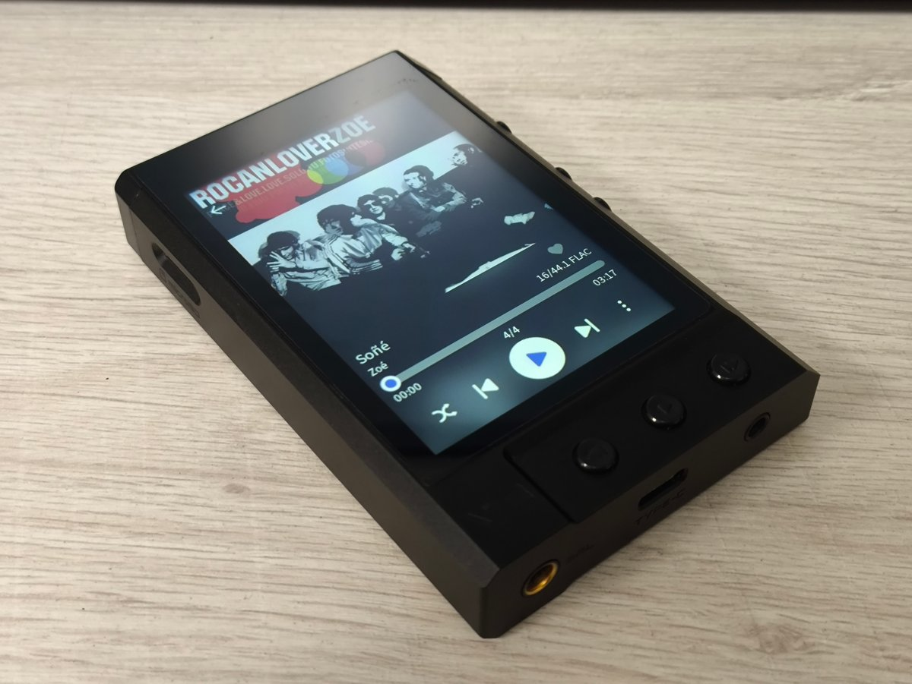

# Firmware para TempoTec V3 Blaze

Firmware oficial TempoTec v1.3 (`V3_ANALOG_2025`) con correcciones para los cortes y los artefactos de audio LDAC en modo Bluetooth Receiver. Versión del proyecto: v1.2.1.

[English](README.md) · [Descargas](https://github.com/carmine-bin/tempotec-v3-blaze-mod/releases) · [Instalación](docs/INSTALL.md) · [Recuperación](docs/RECOVERY.md) · [Compilación](docs/BUILD.md)

## Ediciones

| Edición | Contenido | Archivo |
|---|---|---|
| V3 Blaze v1.3 Stock + Fixes | Aspecto y funciones oficiales, con solo las correcciones de Bluetooth Receiver | `V3-Blaze-v1.3-Stock-Fixes-v1.2.0.upt` |
| V3 Blaze v1.3 Full Mod | Base v1.3 corregida, interfaz personalizada de estilo HiBy y correcciones de UI probadas | `V3-Blaze-v1.3-Full-Mod-v1.2.1.upt` |

Ambas ediciones usan el kernel oficial e incluyen PEQ, búsqueda Bluetooth en tiempo real y mejoras de estabilidad de v1.3. Ambas incluyen las mismas dos correcciones de Bluetooth Receiver:

- **Cortes:** BlueZ mantenía la radio escaneando mientras recibía audio, así que el emisor no podía sostener LDAC 990 kb/s ni a corta distancia. Dos líneas de `/etc/bluetooth/main.conf` detienen esos escaneos; 990 kb/s ahora suena sin audio perdido a distancias que antes fallaban. [Detalles y mediciones](docs/BLUETOOTH-RANGE.md).
- **Artefactos LDAC:** una corrección de un byte en el decoder elimina los artefactos digitales introducidos por la v1.3 oficial. [Evidencia del decoder](docs/LDAC-RECEIVER-ARTIFACTS.md).

Stock + LDAC Fix ahora se llama Stock + Fixes. Stock + Fixes no cambia en v1.2.1.

Full Mod incluye:

- Launcher y categorías de estilo HiBy, interfaz oscura y Now Playing a pantalla completa.
- Relleno de batería y gráficos de carga corregidos, marco de batería rojo con carga baja sin perder el nivel, iconos de ganancia de tres estados, control de brillo y tintado del tema.
- Entrada About en Ajustes, colores del tema, caché de imágenes/base de datos en TF y persistencia del ajuste DAC.
- Correcciones existentes de navegación por álbumes, cuenta regresiva de apagado con Power restaurada y gráficos finales de Balance en Quick Settings.
- Cobertura completa del apagado, encabezados coherentes en las páginas del menú de Now Playing, regreso a la pantalla principal al cambiar el color y redibujado correcto de Ajustes al ocultarse la barra de desplazamiento.

El desplegable tiene un control de brillo; sus controles de volumen están ocultos. Los controles de volumen siguen disponibles en otras pantallas. Full Mod también incluye los ajustes comprobados de read-ahead MMC y presión de caché, los cambios de montaje UBIFS y la corrección de metadatos de la pista siguiente descritos en las [notas técnicas](docs/HOW-IT-WORKS.md). Estos ajustes forman parte de Full Mod; su impacto en el rendimiento no se ha medido.

La interfaz se adaptó a través del port de Kae0 para V3 Analog con gráficos de HiBy. Véanse [créditos](CREDITS.md), [changelog](CHANGELOG.md) y [detalles de las correcciones de UI](docs/UI-FIXES.md).

## Limitaciones conocidas

Con el salvapantallas de carátula activo, la información y la carátula pueden tardar aproximadamente 1.5 segundos en actualizarse después de cambiar de canción. El mismo comportamiento fue reproducido en los firmwares oficiales TempoTec v1.2 y v1.3.

El Blaze ya no usa Bluetooth LE. No se encontró ninguna función del reproductor que lo necesite; A2DP, AVRCP y HiBy Link usan Bluetooth clásico. A más de unos 12 m con paredes de por medio, LDAC 990 kb/s todavía se corta y el emisor baja la tasa; es el límite físico del enlace. [Detalles de Bluetooth Receiver](docs/BLUETOOTH-RANGE.md).

El firmware v1.3 contiene una regla adicional downstream que suprime coeficientes y que no se encontró en las fuentes públicas examinadas. Evitar esa regla corrigió la corrupción de audio LDAC en modo Bluetooth Receiver en hardware V3 Blaze real. Su autor y finalidad son desconocidos. [Evidencia del decoder](docs/LDAC-RECEIVER-ARTIFACTS.md).

## Instalación

Solo para TempoTec V3 Blaze (`V3_ANALOG_2025`), no para el V3 Analog antiguo. Flashear tiene riesgos; lee primero las [instrucciones de recuperación](docs/RECOVERY.md).

**Un archivo llamado `update.upt` tiene prioridad sobre `v3_analog_2025.upt`, incluso al actualizar desde Ajustes. Elimina o renombra cualquier `update.upt` antes de instalar.**

1. **Si hay un `v3_analog_2025.upt` en la raíz de la microSD (por ejemplo, el que dejó la actualización OTA), renómbralo a `v3_analog_2025.upt.stock` antes de copiar el mod. Si no, el mod lo sobrescribirá y perderás tu copia del firmware oficial.**
2. Elige una edición y comprueba su SHA-256 con el [manifiesto v1.2.1](docs/releases/v1.2.1-manifest.json).
3. Renómbrala a `v3_analog_2025.upt` y cópiala a la raíz de una microSD.
4. Selecciona Ajustes → Actualización de firmware → Actualizar mediante microSD. Espera a que termine y reinicie.

Guarda las copias con `.upt.stock` o `.upt.bak`. Consulta [cómo obtener el firmware oficial v1.3](docs/INSTALL.md#getting-the-official-v13-firmware) y [respaldo y restauración](docs/INSTALL.md#backup-and-restore).

El modo desarrollador y ADB vienen desactivados por defecto en ambas ediciones y funcionan igual que en el firmware oficial: toca About 10 veces para activarlos. En la interfaz oficial y en Stock + Fixes, About está en el menú de inicio. El launcher estilo HiBy de Full Mod no tiene esa entrada, así que Full Mod muestra About en Ajustes (la configuración oficial de Ajustes oculta esa entrada porque el menú de inicio ya la tiene). Este proyecto no activa ADB ni cambia cómo funciona el modo desarrollador.

Ambos paquetes tienen 44,367,872 bytes.

| Edición | SHA-256 | MD5 |
|---|---|---|
| Stock + Fixes | `5ce109414e739546ed19d5cc74ad9b92e5a58f8545d5d3a482f673934a5929af` | `4e9408a7415b66fdad7d0ad560103194` |
| Full Mod | `db91cf52c3ac0f0005d90563bc1fa7f9e3e85abdb2c5ce3fe2e9100c18e6695a` | `d553a52f4fe924e1f663c0e3ac1ff992` |

## Desarrollo y licencia

Las [instrucciones de compilación](docs/BUILD.md) explican cómo generar ambas ediciones y comprobar su contenido. [CONTRIBUTING.md](CONTRIBUTING.md) describe las pruebas en el dispositivo.

El desarrollo y parte del trabajo de ingeniería inversa contó con asistencia de herramientas de IA. Los cambios publicados del firmware fueron revisados y probados en hardware V3 Blaze real.

La licencia MIT cubre las herramientas y documentación originales. El firmware, los gráficos importados y el código LDAC conservan sus respectivos titulares. Véanse [NOTICE.md](NOTICE.md) y [LICENSE](LICENSE). Sin afiliación con TempoTec ni HiBy.
