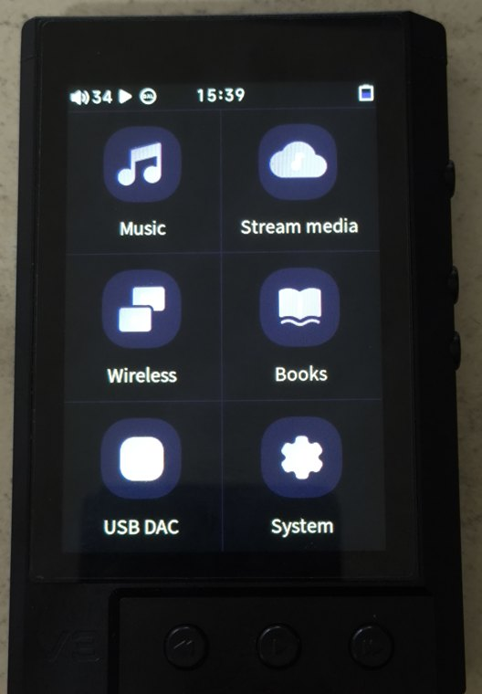
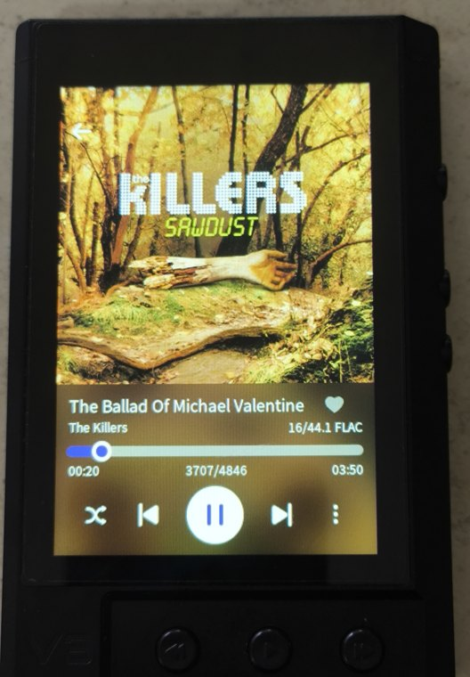

# TempoTec V3 Blaze firmware

Official TempoTec v1.3 (`V3_ANALOG_2025`) with a correction for Bluetooth Receiver LDAC audio artifacts. Project version: v1.1.2.

 

[Español](README.es.md) · [Downloads](https://github.com/carmine-bin/tempotec-v3-blaze-mod/releases) · [Install](docs/INSTALL.md) · [Recovery](docs/RECOVERY.md) · [Build](docs/BUILD.md)

## Editions

| Edition | Contents | Filename |
|---|---|---|
| V3 Blaze v1.3 Stock + LDAC Fix | Official appearance and features, with only the LDAC decoder correction | `V3-Blaze-v1.3-Stock-LDAC-Fix.upt` |
| V3 Blaze v1.3 Full Mod | Corrected v1.3 base, customized HiBy-style interface and tested UI fixes | `V3-Blaze-v1.3-Full-Mod-v1.1.2.upt` |

Both editions use the official kernel and include v1.3 PEQ, real-time Bluetooth search and stability improvements. Stock + LDAC Fix is unchanged from the previous release. Full Mod v1.1.2 includes the UI fixes tested on a physical V3 Blaze.

Full Mod includes:

- HiBy-style launcher, category artwork, dark interface and fullscreen Now Playing.
- Corrected battery fill and charging artwork, three-state gain icons, brightness control and accent tinting.
- About/developer access, theme colors, TF image/database caching and DAC-setting persistence.
- Existing album browsing fixes, restored Power-button shutdown countdown and final Balance Quick Settings artwork.
- Complete shutdown-screen coverage, consistent headers on Now Playing menu pages, theme-color changes returning to the main screen and correct Settings redraws when the scrollbar hides.

The pull-down has a brightness slider; its volume controls are hidden. Volume controls remain available elsewhere. Full Mod also includes the guarded MMC read-ahead and cache-pressure settings, UBIFS mount changes and next-track metadata correction described in [technical notes](docs/HOW-IT-WORKS.md). These tweaks are kept from the Full Mod configuration; their performance impact has not been benchmarked.

The interface was adapted through Kae0's V3 Analog port of HiBy artwork. See [credits](CREDITS.md), [changelog](CHANGELOG.md) and [UI fix details](docs/UI-FIXES.md).

## Known limitations

When the album-art screensaver is active, track information and artwork may take about 1.5 seconds to update after a track change. The same behavior was reproduced on official TempoTec v1.2 and v1.3 firmware.

Bluetooth reception has limited link margin, particularly with sustained high-bitrate LDAC and in difficult RF conditions. AAC has been more reliable in testing. This is separate from the v1.3 LDAC audio corruption corrected by this project. The cause of the weak RF link is still unknown. [Link observations](docs/BLUETOOTH-RANGE.md).

Firmware v1.3 contains an additional downstream coefficient-suppression rule that was not found in the public sources examined. Bypassing that rule corrected the Bluetooth Receiver LDAC audio corruption on physical V3 Blaze hardware. Its author and purpose are unknown. [Decoder evidence](docs/LDAC-RECEIVER-ARTIFACTS.md).

## Install

Only for TempoTec V3 Blaze (`V3_ANALOG_2025`), not the older V3 Analog. Flashing carries risk; read [recovery instructions](docs/RECOVERY.md) first.

1. Choose an edition and verify its SHA-256 against the [v1.1.2 manifest](docs/releases/v1.1.2-manifest.json).
2. Rename it to `v3_analog_2025.upt` and copy it to the root of a microSD card.
3. Select Settings → Firmware update → Update via micro SD card. Wait for flashing and reboot to finish.

Keep backup firmware under `.upt.stock` or `.upt.bak`. A file named `update.upt` takes priority over `v3_analog_2025.upt`, even when updating from Settings.

Both packages are 44,367,872 bytes.

| Edition | SHA-256 | MD5 |
|---|---|---|
| Stock + LDAC Fix | `273f56607d477d44bd071c1a3e2097361610c2e403cfddc7ccf51b98a56210d1` | `cd380b93df9a600a5d24cb64585aac88` |
| Full Mod | `6bd0c1bf1973241efe6985d6da63572197f502b190851883876d82e8255017e8` | `f85adf2d2f5bc684061f9c27fa6c5d56` |

## Development and licence

See [build instructions](docs/BUILD.md) to build either edition and check its contents. [CONTRIBUTING.md](CONTRIBUTING.md) covers device testing.

Development and reverse-engineering work was assisted by AI tools. All released firmware changes were reviewed and tested on physical V3 Blaze hardware.

The MIT licence covers original tooling and documentation. Firmware, imported artwork and LDAC code retain their respective rights holders. See [NOTICE.md](NOTICE.md) and [LICENSE](LICENSE). Not affiliated with TempoTec or HiBy.
